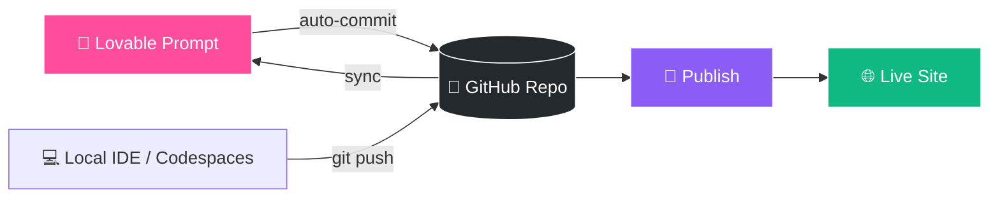

<!-- ═══════════════ ANIMATED HEADER BANNER ═══════════════ -->
<div align="center">


<!-- Typing animation -->
<a href="https://lovable.dev/projects/87a87076-2c7c-4490-87db-2bd8baf3b8e9">
  
</a>

<br/>

<!-- Live badges -->
<a href="https://lovable.dev/projects/87a87076-2c7c-4490-87db-2bd8baf3b8e9"></a>


<br/><br/>

<!-- Live repo stats (replace YOUR_USERNAME/YOUR_REPO) -->


<br/><br/>

**[🚀 Live Demo](#-deploy)** &nbsp;•&nbsp; **[⚡ Quick Start](#-quick-start)** &nbsp;•&nbsp; **[🛠 Tech Stack](#-tech-stack)** &nbsp;•&nbsp; **[✏️ Editing Options](#️-how-can-i-edit-this-code)** &nbsp;•&nbsp; **[🌐 Custom Domain](#-custom-domain)**

</div>


## 📖 About

A modern web application created with **[Lovable](https://lovable.dev/projects/87a87076-2c7c-4490-87db-2bd8baf3b8e9)** — the AI-powered app builder. Changes made on Lovable are **auto-committed** to this repo, and changes pushed here are **synced back** to Lovable.

| 🔗 Project Info | |
|---|---|
| **Lovable URL** | [Open project](https://lovable.dev/projects/87a87076-2c7c-4490-87db-2bd8baf3b8e9) |
| **Project ID** | `87a87076-2c7c-4490-87db-2bd8baf3b8e9` |
| **Sync** | 🔄 Two-way (Lovable ⇄ GitHub) |


## 🛠 Tech Stack

<div align="center">


</div>

| Layer | Technology | Why |
|:---:|:---|:---|
| ⚡ **Build Tool** | [Vite](https://vitejs.dev/) | Lightning-fast dev server & builds |
| ⚛️ **UI Library** | [React](https://react.dev/) | Component-based UI |
| 🟦 **Language** | [TypeScript](https://www.typescriptlang.org/) | Type-safe code |
| 🎨 **Styling** | [Tailwind CSS](https://tailwindcss.com/) | Utility-first CSS |
| 🧩 **Components** | [shadcn/ui](https://ui.shadcn.com/) | Accessible, customizable components |


## ⚡ Quick Start

> **Requirements:** [Node.js & npm](https://github.com/nvm-sh/nvm#installing-and-updating) (install with nvm)

```bash
# 1️⃣ Clone the repository
git clone <YOUR_GIT_URL>

# 2️⃣ Navigate to the project directory
cd <YOUR_PROJECT_NAME>

# 3️⃣ Install dependencies
npm i

# 4️⃣ Start the dev server (auto-reload + instant preview)
npm run dev
```

🎉 Open **http://localhost:8080** (or the URL shown in your terminal) and start building!

### 📜 Available Scripts

| Command | What it does |
|:---|:---|
| `npm run dev` | 🔥 Start development server with hot reload |
| `npm run build` | 📦 Create a production build |
| `npm run preview` | 👀 Preview the production build locally |
| `npm run lint` | 🧹 Lint your code |


## ✏️ How can I edit this code?

Pick the workflow that suits you — click to expand 👇

<details>
<summary><b>💜 &nbsp;Use Lovable</b> &nbsp;<i>(easiest — just prompt!)</i></summary>
<br/>

Visit the [Lovable Project](https://lovable.dev/projects/87a87076-2c7c-4490-87db-2bd8baf3b8e9) and start prompting. Changes made via Lovable are committed automatically to this repo.

</details>

<details>
<summary><b>💻 &nbsp;Use your preferred IDE</b></summary>
<br/>

Clone this repo and push changes — they'll be reflected in Lovable too. Follow the [Quick Start](#-quick-start) steps above.

</details>

<details>
<summary><b>✍️ &nbsp;Edit directly in GitHub</b></summary>
<br/>

1. Navigate to the desired file(s)
2. Click the **Edit** button (✏️ pencil icon) at the top right of the file view
3. Make your changes and **commit**

</details>

<details>
<summary><b>☁️ &nbsp;Use GitHub Codespaces</b></summary>
<br/>

1. Go to the main page of your repository
2. Click the green **Code** button near the top right
3. Select the **Codespaces** tab
4. Click **New codespace** to launch an environment
5. Edit files, then commit and push your changes

</details>


## 🔄 Workflow at a Glance




## 🚀 Deploy

Deploying takes **one click**:

> **Lovable → Share → Publish** 🎉

[](https://lovable.dev/projects/87a87076-2c7c-4490-87db-2bd8baf3b8e9)


## 🌐 Custom Domain

Yes, you can connect your own domain! 🙌

1. Open your project in Lovable
2. Go to **Project → Settings → Domains**
3. Click **Connect Domain**

📚 Read more: [Setting up a custom domain](https://docs.lovable.dev/features/custom-domain#custom-domain)


## 🗂 Suggested Project Structure

<details>
<summary>📁 Click to view</summary>

```
├── public/            # Static assets
├── src/
│   ├── components/    # Reusable UI components (shadcn/ui lives here)
│   ├── pages/         # Route-level pages
│   ├── hooks/         # Custom React hooks
│   ├── lib/           # Utilities & helpers
│   ├── App.tsx        # Root component
│   └── main.tsx       # Entry point
├── index.html
├── tailwind.config.ts
├── vite.config.ts
└── package.json
```

</details>


## 🤝 Contributing

Contributions, issues and feature requests are welcome!

1. 🍴 Fork the repo
2. 🌿 Create your branch: `git checkout -b feature/amazing-feature`
3. 💾 Commit: `git commit -m "Add amazing feature"`
4. 📤 Push: `git push origin feature/amazing-feature`
5. 🔃 Open a Pull Request

<!-- ═══════════════ ANIMATED FOOTER ═══════════════ -->
<div align="center">

<br/>


</div>
